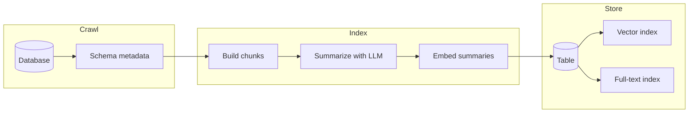
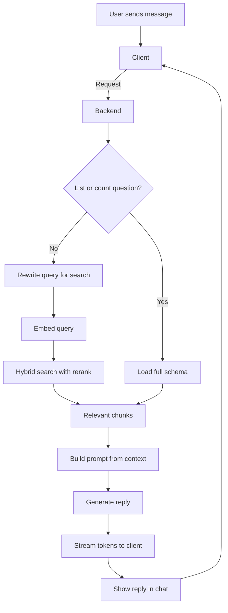

# SchemaSight

**Chat with your database. Locally.**

VS Code extension: connect to SQL Server, PostgreSQL, or MySQL; index your schema and stored procedures; ask questions in plain English. All processing runs on your machine.

[](https://opensource.org/licenses/MIT)
[](https://code.visualstudio.com/)

## Table of contents

- [Features](#features)
- [Prerequisites](#prerequisites)
- [Installation](#installation)
- [Usage](#usage)
- [Development](#development)
- [Architecture](#architecture)
- [License](#license)

## Features

- Add and manage DB connections
- Crawl and index schema + stored procedures (local embeddings + LLM summaries)
- Chat: ask about tables, procedures, relationships (RAG over the index)

## Prerequisites

- Node.js (LTS)
- [Ollama](https://ollama.ai/) with a model pulled (e.g. `ollama pull llama3.1:8b`)
- VS Code 1.85+

## Installation

- **From VSIX (local build):** Run `npm run build`, then in VS Code: **Extensions** → **...** → **Install from VSIX** → choose `dist/*.vsix` (if you package with `vsce package`).
- **From Marketplace:** _(when published)_ Install "SchemaSight" from the [VS Code Marketplace](https://marketplace.visualstudio.com/).

## Usage

1. Open the SchemaSight view (sidebar icon) or run **SchemaSight: Open Panel** from the command palette.
2. Add a connection (SQL Server, PostgreSQL, or MySQL) with host, database, and credentials.
3. **Crawl** the connection to index schema and stored procedures (runs locally: Ollama + Transformers.js + LanceDB).
4. Select the connection and chat in plain English about tables, relationships, or procedures.

## Development

```bash
npm install
npm run build
```

Open the repo in VS Code → **F5** to launch the Extension Development Host. Use the SchemaSight sidebar icon or **SchemaSight: Open Panel** in the dev host.

## Architecture

### Project structure

| Path | Role |
|------|------|
| `src/extension.ts` | Entry point |
| `src/db/` | Connections, drivers (mssql, postgres, mysql) |
| `src/llm/` | Ollama client, prompts |
| `src/embeddings/` | Transformers.js (text → vectors) |
| `src/vectorstore/` | LanceDB index, indexer |
| `src/webview/` | React UI, message router |

### Pipeline

Indexing a connection: from DB metadata to searchable chunks in LanceDB.



1. **Crawl**
   - Reads DB metadata: tables (with columns, types, PK/FK), views, stored procedures, functions.
   - Output: structured schema per connection (e.g. `DatabaseSchema` with `tables`, `views`, `storedProcedures`, `functions`).

2. **Summarize**
   - One short summary per chunk (table, view, procedure, or function).
   - Ollama generates summaries from object type, name, and content.
   - Bounded concurrency so we don’t overload the LLM.

3. **Embed**
   - Transformers.js (local) embeds each summary into a vector.
   - Done in batches; vectors are attached to the corresponding chunks.

4. **Store**
   - One LanceDB table per connection; bulk upsert with an explicit Arrow schema (embedding as `FixedSizeList` of float).
   - **Vector index:** IVF-PQ, cosine distance — created only when row count ≥ 256 (LanceDB minimum for training).
   - **FTS index:** LanceDB built-in full-text index on the `content` column.
   - Optional type filter (e.g. tables only) is applied at query time.

5. **Chat (RAG)** — See [Chat data flow](#chat-data-flow) below.

### Chat data flow

From user message to streamed reply: context retrieval, prompt build, and streaming.



1. **Request**
   - Webview sends the chat request (connection id, user message, history) to the extension.

2. **Retrieve context**
   - **Broad query** (e.g. “list all tables”, “how many procedures?”): we load the full schema via `getAllChunks` so the model can list or count.
   - **Otherwise:** optional Ollama rewrite of the message for search, then embed the (rewritten or original) query and run **hybrid search** (LanceDB full-text on `content` + vector similarity, RRF rerank).
   - Result: top-k chunks used as context.

3. **Generate reply**
   - System prompt is built from those chunks and the database name.
   - Ollama is called with that prompt, conversation history, and the user message; reply is streamed token by token.

4. **Stream back**
   - Extension sends each token to the webview; then sends completion or error.
   - Webview appends tokens to the assistant message and clears streaming state when done.

Embedding and LLM run locally; webview and extension communicate via `postMessage`.

## License

MIT
